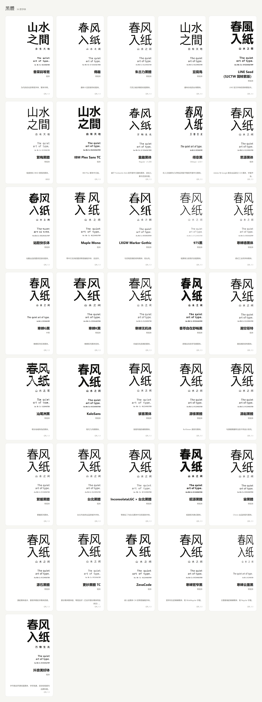
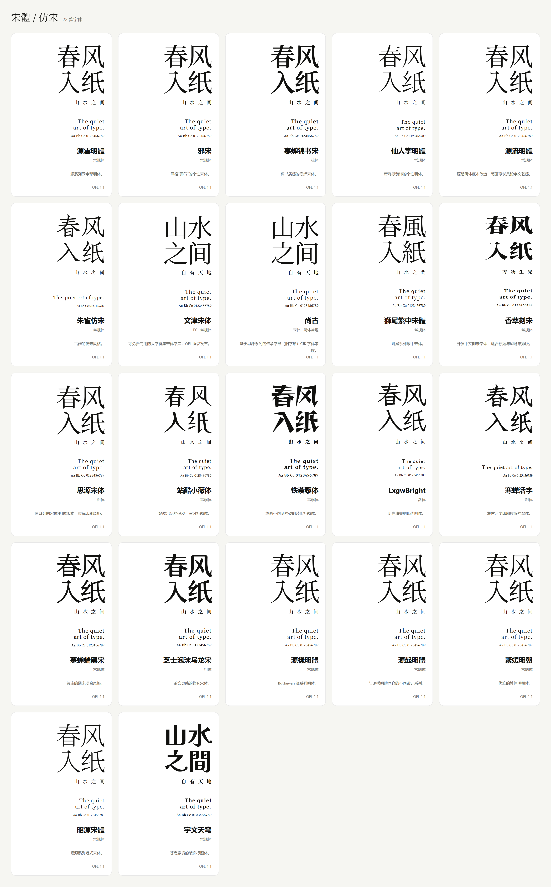
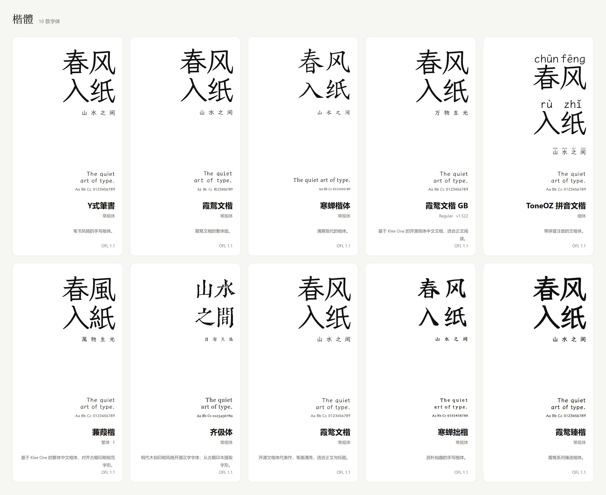
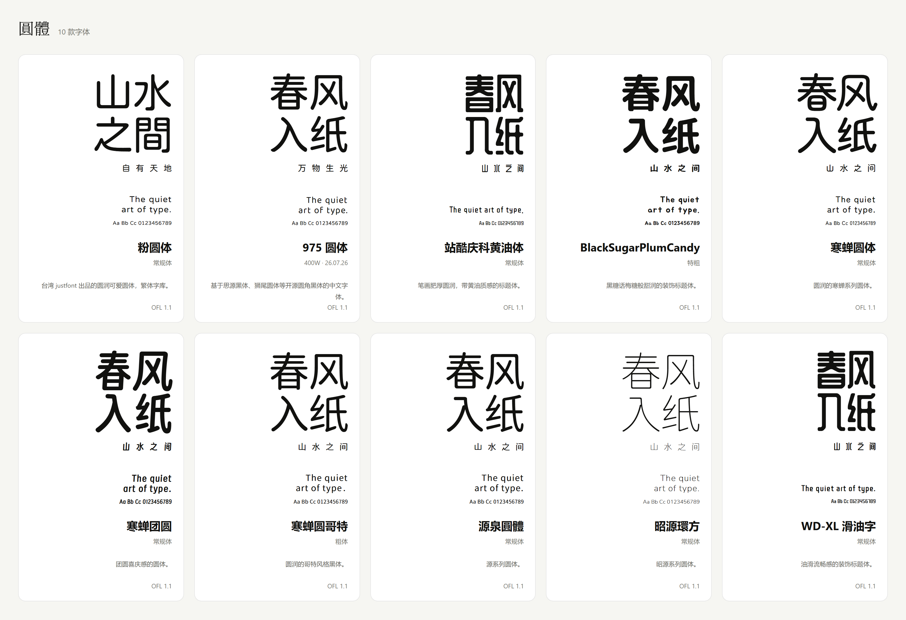
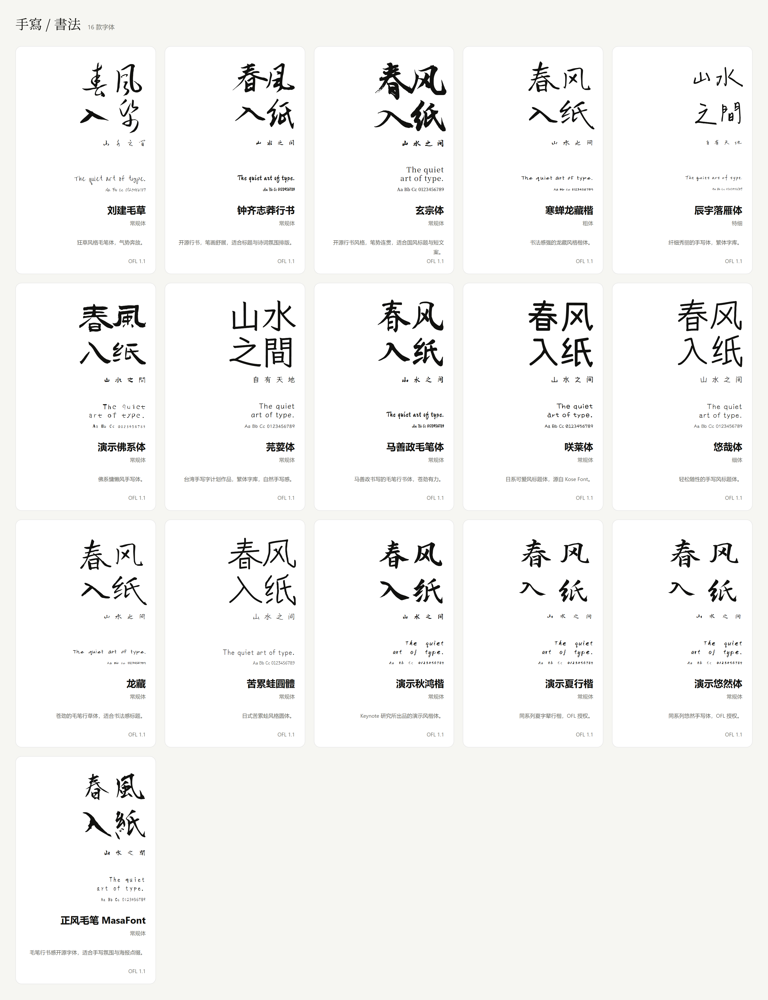

# awesome-Fonts-skill

收录 94 款中文字体及变体，按字形分类，附样张与来源。可在线浏览，也可作为 Skill 为文章、网页和海报选字、搭配。

[在线浏览字体](https://tanglele110-hash.github.io/awesome-Fonts-skill/) · [字体清单](CATALOG.md)

## 字体目录

### 黑体

### 宋体 / 仿宋

### 楷体

### 圆体

### 手写 / 书法

## 如何使用

打开[字体页面](https://tanglele110-hash.github.io/awesome-Fonts-skill/)，按分类、标签或名称筛选，点击卡片查看字体来源。

在支持 Skill 的工具中，将整个仓库下载为 `awesome-fonts-skill`，放入工具的 Skills 目录，然后说明用途和风格：

> 使用 $awesome-fonts-skill，为一篇中文长文搭配标题和正文字体，偏安静、有书卷感，并提供字体来源。

## 授权与来源

字体版权归原作者。收录字体采用 OFL-1.1 或 0BSD，逐款来源、许可与复核结果见[授权记录](LICENSE-REVIEW.md)。

网页仅提供样张子集，完整字库请到来源获取。原创脚本与说明采用 [MIT License](LICENSE)。

[整理：木渡川@tanglele0318](https://x.com/tanglele0318)
